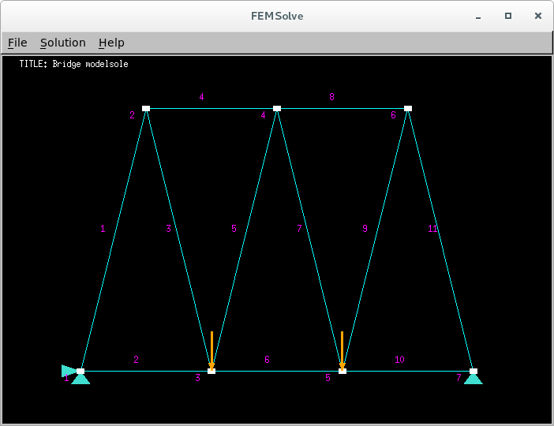
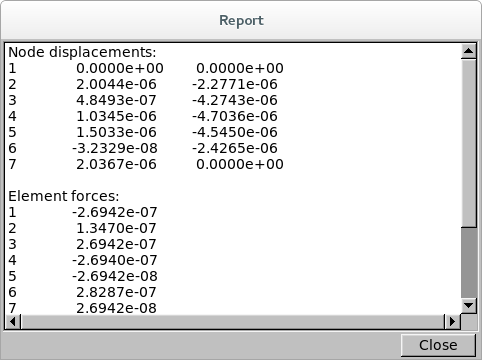
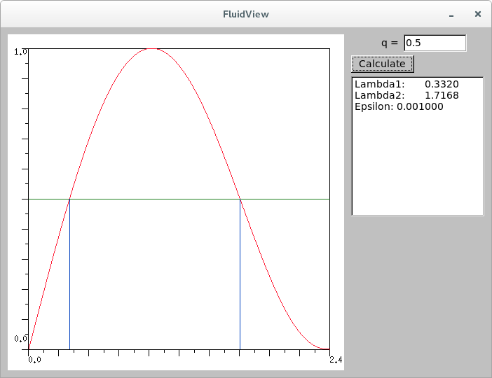
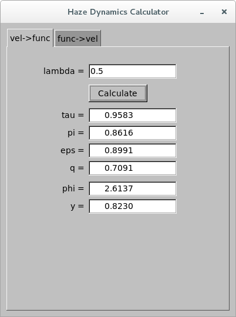
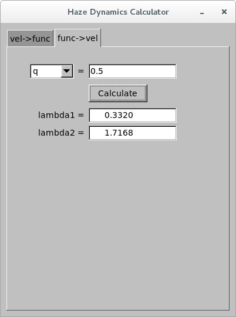
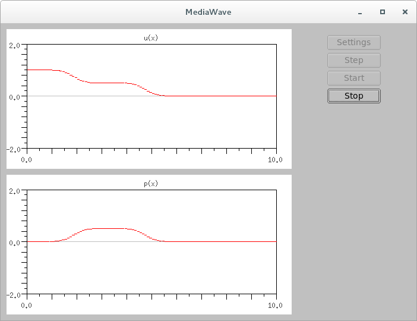
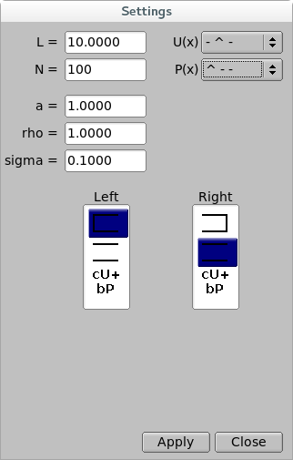
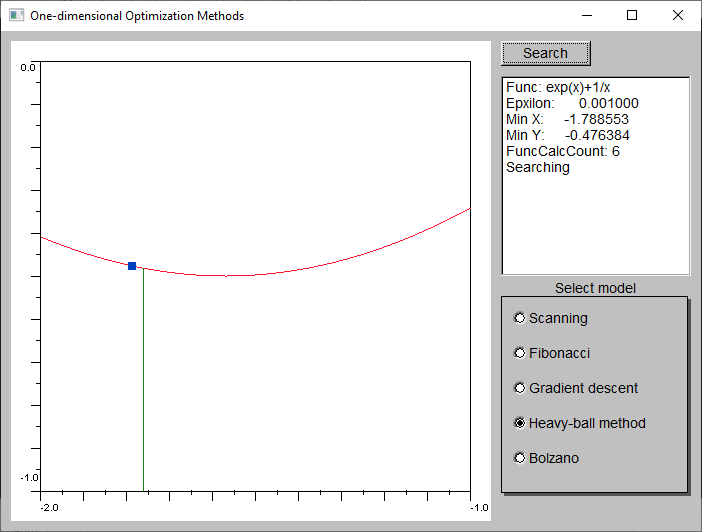
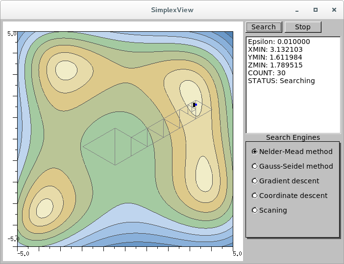
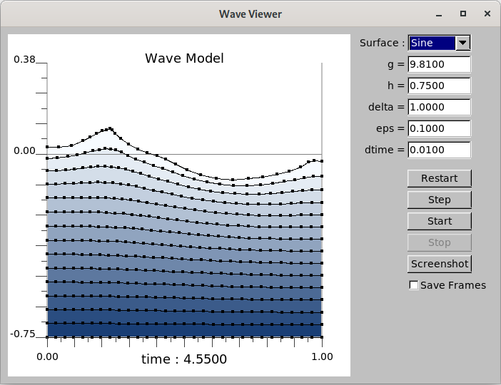

## Introduction

This is the collection of various applications for mechanics simulations and structural engineering models. 

## Getting Started

All projects use CMake as build system. C++ code compatibility is tested
with gcc-5 and Microsoft Visual Studio Express 2008 and 2012.

## Built With

* [CMake](https://cmake.org/) - Build system.
* [FLTK](http://www.fltk.org) - Minimalistic cross-platform GUI toolkit with OpenGL capabilities.
* [Armadillo](http://arma.sourceforge.net) - Linear algebra library (for FEMSolve)

## Environment Setup

### Debian-based Systems

The following instructions are applied to these operating systems:

* Ubuntu 18.04
* Ubuntu 16.04
* Debian 9

```
sudo apt-get install -y \
    build-essential \
    cmake \
    libarmadillo-dev \
    libfltk1.3-dev \
    libfltk1.3-compat-headers
```

### RedHat-based Systems

The following instructions are applied to these operating systems:

* Fedora >=22

```
sudo dnf groupinstall -y \
    "Development Tools" \
    "Development Libraries"
sudo dnf install -y \
    gcc-c++ \
    cmake \
    fltk \
    fltk-devel \
    fltk-fluid \
    armadillo \
    armadillo-devel
```

## Building Projects

The set of programs is built with the commands below.

```
cd MechanicsPrograms
mkdir build && cd build
cmake ..
make
```

After the successful build the binary of `{Project}`  will end up in `build/{Project}/`.
E.g. binary of `FEMSolve` can be launched from the build directory with the command

```
./FEMSolve/FEMSolve
```
 
## Structure

### FEMSolve

[Finite element method](https://en.wikipedia.org/wiki/Finite_element_method) solver
for 1D and 2D models with GUI. Example models are written in plain-text format 
and can be found in __models__ subdirectory.




### FinitElem

Minimalistic Finite element method solver from __FEMSolve__ in a form
of console application.

### FluidView

Graphical solver for fluid flow q and lambda functions that uses [Newton's method](https://en.wikipedia.org/wiki/Newton%27s_method).



### HazeDyn

Calculator for fluid flow functions and reverse calculator
for finding lambda parameter based on function value.




### MediaWave

Graphical demonstration of fluid mechanics problem of haze in a tube
of limited length with various initial boundary conditions for the tube
edges (e.g. closed, opened, with friction) as well as for pressure and velocity
of a fluid.




### GraphView

Methods of one-dimensional optimizaion:
* Fibonacci optimization method
* [Gradient descent](https://en.wikipedia.org/wiki/Gradient_descent)
* Heavy ball method
* Bolzano or half-division method
* Scanning method



### SimplexView

GUI tool originally designed for demonstration of Nelder–Mead optimization
method using triangle simplex for functions with two parameters (hence the name).
Later several other methods of function minimizaion were added. Now the following
methods are supported with graphical demonstration for each of them:

* [Nelder–Mead method](https://en.wikipedia.org/wiki/Nelder%E2%80%93Mead_method) with triangle as simplex polygon.
* [Gauss–Seidel method](https://en.wikipedia.org/wiki/Gauss%E2%80%93Seidel_method).
* [Gradient descent](https://en.wikipedia.org/wiki/Gradient_descent).
* [Coordinate descent](https://en.wikipedia.org/wiki/Coordinate_descent).
* Scanning method.

Left mouse click on the 2D plot sets the new starting point for optimization
method for the next scan.



### WaveView

Graphical demonstration of fluid mechanics problem of a fluid in
rectangular channel of infinite length.


